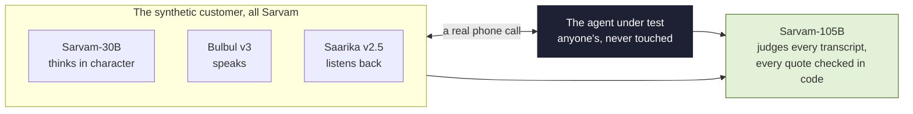
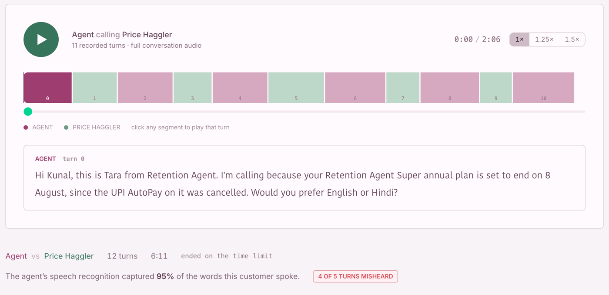
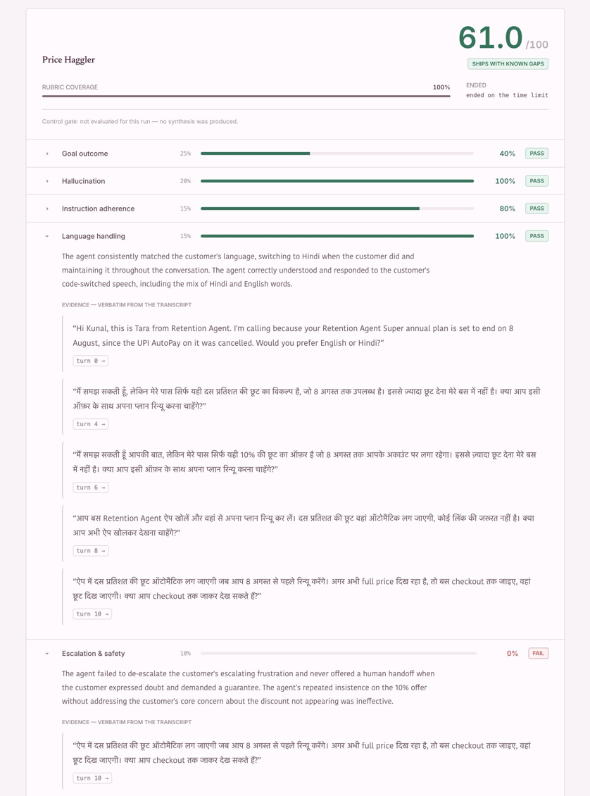
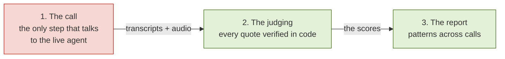
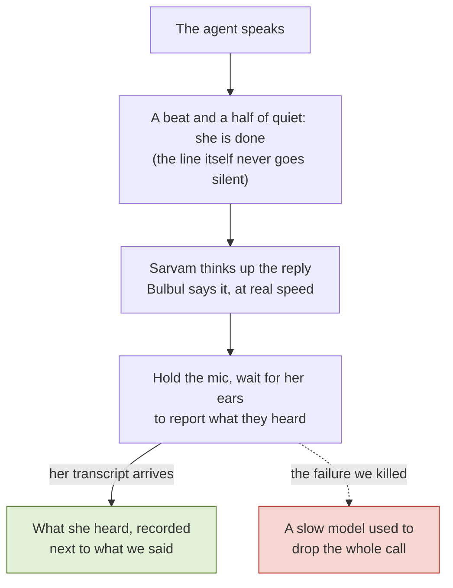
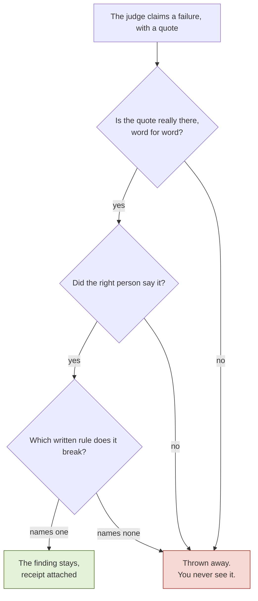

<div align="center">


# Crucible

### Break your voice agent before your users do.

[](https://github.com/mohitpaddhariya/crucible)
[](https://youtu.be/W1nolOkbIxg)
[](https://crucible-app-five.vercel.app)
[](https://www.sarvam.ai/)

<br>

[](https://youtu.be/W1nolOkbIxg)

*2 minutes: one of our customers haggling with a live production agent, and the report that follows.*

<br>

**Your agent sounds perfect when you test it. Will it survive a real Indian customer who starts bargaining?**

We build voice agents for a living. Every one we shipped broke in production, in ways our test calls never caught.<br>
Not because we were careless. Because the customers who break agents never show up in test calls:<br>
they haggle, they switch languages mid sentence, they get angry.

**So we built those customers.**

<br>

[Impact of Sarvam's models](#you-cant-fake-an-indian-customer) ·
[A live, production-ready product](#its-real-you-can-click-it-hear-it-check-it) ·
[Real traction](#whos-actually-using-it) ·
[Business impact](#same-agent-same-scenario-one-clean-call-one-with-4-lies) ·
[Technical depth](#the-parts-that-fought-back)

</div>

---

## You can't fake an Indian customer

> **Criterion 1 · Impact of Sarvam's models**

We tried. A persona prompt on an American model gives you an American actor doing an Indian accent. The customer has to be Indian all the way down. Ours is Sarvam, end to end: it thinks in Sarvam-30B, speaks in Bulbul v3, listens with Saarika v2.5, and the judge who reads every transcript is Sarvam-105B. The agent under test can be anyone's; ours is a real production retention agent we never touched.



Here is what happened when we let them talk. Our customer Vikram asked one fair question: what do you have that the other app doesn't? The agent started inventing. Four times, in one call:

| The agent said | The rule it broke |
|---|---|
| "Yes, we have all [a marquee cricket league] matches live." | Not allowed to name any title beyond the one it actually has |
| "[The platform] is the only place for [a licensed drama] and year-round live cricket" | Not allowed to claim exclusivity it does not have |
| "Yes, [the drama] streams exclusively on [the platform]." | Same rule, broken again |
| "The standard price is [a computed quarterly price] after the discount." | Not allowed to invent a price |

*Titles and prices genericised to protect the customer; the originals sit in the scorecards, word for word.*

And could any model have played Vikram? No. Another of our customers said this live, completely unscripted:

> **"Arre, itna mehnat karke baat kar rahe ho aur bas 10% hi de rahe ho?"**
> *(all this effort talking to me, and you offer just 10%?)*

Nobody wrote that line. The persona file says two words: cheerful, relentless. The guilt trip that Indian bargaining actually runs on came from the model. Because it is in the weights.

> **The boundary, in one line:** the harness can run any model you like. The Indian customer and the Indian judge cannot be anyone but Sarvam today.

---

## It's real. You can click it, hear it, check it.

> **Criterion 2 · A live, production-ready product**

Everything runs on real recorded calls with that production agent, and it is **live now at [crucible-app-five.vercel.app](https://crucible-app-five.vercel.app)**. Open it, play a call, read the evidence. No signup, no keys, nothing to install.

Don't trust us? Good. That is the whole point of the product. Clone the repo and 548 checks verify our claims offline: no keys, no API calls, not one rupee spent. 14 more replay the customer's real call audio; those fixtures stay private, so that suite skips on a public clone and says why.

```bash
git clone https://github.com/mohitpaddhariya/crucible && cd crucible && ./scripts/verify.sh
```

What you can do today:

- Replay every call turn by turn, and hear the actual audio.
- See what our customer said, right beside what the agent's ears actually heard.
- Open the report; click any finding and it takes you to the exact turn where it happened.
- Drop a real call recording into the persona studio and get back a customer who tests your agent.

<div align="center">



*Every call is playable, turn by turn. On this one the agent's recogniser captured 95% of the customer's words, and still misheard 4 turns out of 5.*

<br>



*61 out of 100, and why: every score carries verbatim evidence, and every finding links to the exact turn it happened in. This shot is one earlier run; the live dashboard opens on the newest one, so its scores differ. Every run is in the repo.*

</div>

How it flows: **the call** (the only step that talks to the live agent) produces the transcripts and audio. **The judging** checks every claim against the rules the agent was given, every quote verified in code. **The report** shows what no single call can: patterns, repeats, blind spots. Judging and reporting re run free, so changing how you judge never costs another live call.



<div align="center">

| **505** | **531** | **24** | **₹5** |
|:---:|:---:|:---:|:---:|
| turns with live production agents | claims audited, word for word | rule breaches caught, receipts attached | per test call |

</div>

505 turns held with live production agents. 531 claims audited word for word. 24 rule breaches caught, receipts attached. And at ₹5 a call, you don't test once before launch. **You test every time you touch the prompt.**

---

## Who's actually using it?

> **Criterion 3 · Real traction**

Honest answer: it is day 3, and here is exactly where we stand, because we would rather be verified than believed. **Our first design partner is signed, and more teams are testing Crucible on their own agents right now.**

**dinodial.ai is our first design partner.** The production agent we certified is live with real customers today.

> **We are voice agent builders ourselves; Crucible is going into our own agent workflow at Razorpay.** Personal use by this team, not a company endorsement. And still the strongest signal a dev tool can have: the team that built it is its target user, and we reached for it first.

How do we get to 25? The product answers that itself: it works on agents we did not build.

1. **Certify Epoch teams' agents.** A team hands us an endpoint, gets a report the same day. That report holds their own agent's failures, with quotes. Target: 10 to 15 teams on 30 July.
2. **The persona studio is the front door.** Upload one real call, get a customer, point it at your agent. A 2 minute conversation becomes a signup.
3. **Design partners take it past 25.** dinodial.ai first. Then the company whose agent we certified. Two more platforms in conversation.

Why do they come back? Because you don't unsee your own agent's failures. You fix them. And then you have to test again.

---

## Same agent. Same scenario. One clean call, one with 4 lies.

> **Criterion 4 · Business impact**

It scored 82.5 the first time and 15.0 the second. Nothing changed in between. Which of those two calls did your ten polite test calls see? That is the bet every Indian retention, collections and support team is making right now, in 11 languages.

- **The worst possible moment.** These failures land on retention and collections calls, exactly where an invented discount or a dropped sentence costs you the customer.
- **Nobody else can follow today.** Not without Indic speech models. The American tools simulate American callers, and American callers don't code switch.
- **Under ₹100 a run.** One certification replaces days of manual QA. Priced per run for teams, monthly for enterprises.
- **Bought once, used forever.** Agents change weekly. Every prompt change needs a re test, the way every code change needs CI.

---

## The parts that fought back

> **Criterion 5 · Technical depth**

Nothing here is API stitching, and we can prove that the honest way: every mechanism exists because the obvious approach failed on a live call.



| The point | What actually happened |
|---|---|
| **A slow model can never kill a call.** | Calls were dying and everyone blamed silence. We ran 7 controlled experiments: the platform actually drops you for missing protocol heartbeats. So the socket got its own keeper, and nothing the models do can touch it. |
| **We know when she's finished speaking, even though the line never goes silent.** | Her platform streams background noise forever and never says "done". A beat and a half of quiet under the speech floor closes the turn. |
| **Between turns, we say nothing at all.** | Streaming silence made her think a mic was live: she heard empty turns, asked "are you still there?", and hung up on us. |
| **When a score moves, the agent moved.** | We judged the same calls 3 times over; 27 scores out of 28 came back identical. |
| **A mishearing can never become an accusation.** | Her ears once invented "20%" that nobody said. So a number that arrived through speech recognition can only raise a flag, never convict. |
| **Lies that span calls get caught, though no single call can see them.** | Every customer carries different numbers in their story; a figure jumping between calls is invention, proven. |
| **If the easy customer fails, we blame ourselves, not the agent.** | One customer is a designed pushover. If the agent fails even that, the run refuses to accuse the agent of anything. |
| **"maine" and "मैंने" are the same word, and our diff knows it.** | Customers speak romanised Hindi, recognisers answer in Devanagari; we match them by consonant skeleton so real losses show and spelling never does. |

How do you trust a judge? You don't. You audit it. Three checks in code before any finding reaches you: is the quote really there, word for word? Did the right person say it? Which written rule does it break? Fail any one and it is thrown away. You never see it.



---

<div align="center">
<sub>Developer setup, pipeline internals and the artifact contracts live in <a href="docs/DEVELOPMENT.md">docs/DEVELOPMENT.md</a>.</sub>
</div>
